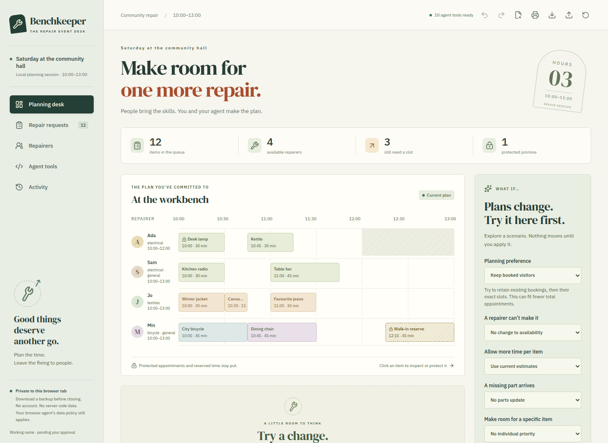
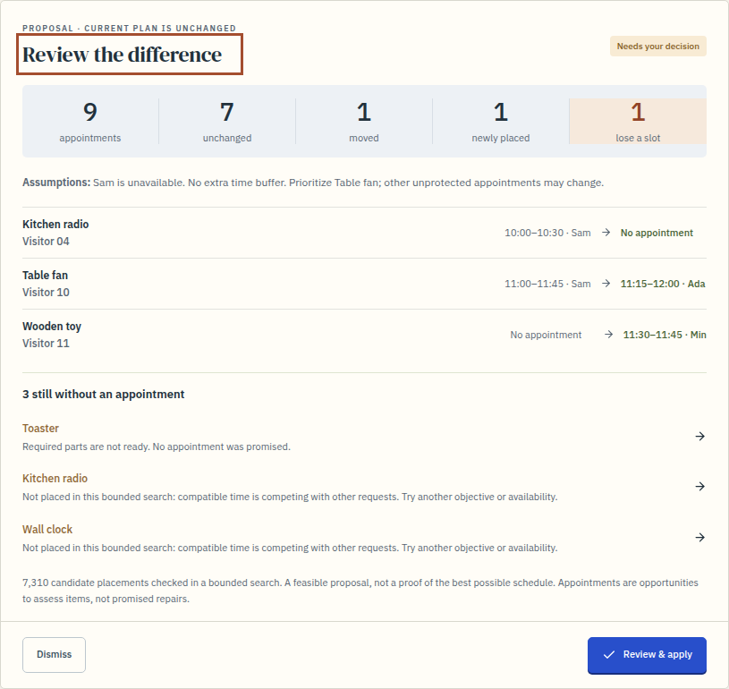
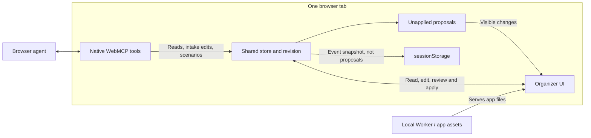

# Benchkeeper

Benchkeeper helps organizers schedule community repair events, where people bring broken household items and volunteers help fix them. Match requests to volunteers, protect promised appointments, and review a browser agent's proposed schedule before applying it.

**[Try the live app](https://benchkeeper.gpj.workers.dev)** · **[Public source](https://github.com/garethpaul/benchkeeper)** · **[MIT license](LICENSE)**

Manual planning works in ordinary browsers. Real browser-native WebMCP is verified on the hosted origin in Chrome 152 with WebMCP enabled; it is not generally available in unflagged browsers. See [deployment and live verification](docs/deployment-readiness.md).



_Viewport excerpt from the live app, using synthetic example data._

## Visual design

A workshop-ledger treatment pairs deep ink navigation and warm paper with cobalt controls and an orange session ticket. Ruled statistics, appointment edge markers and stronger typography distinguish the committed schedule from a proposed change. Fonts stay self-hosted, and the design retains narrow-screen layouts, keyboard focus, forced-color support and reduced-motion behavior.

## Run locally

Node 24+ is required; use a current Node 24 LTS release. Linux verification passed with Node 24.13.1, 24.20.0 and 26.8.1. Node 26 was a compatibility check, not a recommendation to replace LTS. [Official Node releases](https://nodejs.org/en/about/previous-releases)

From this project directory:

```sh
npm ci --cache work/npm-cache
npm run dev
```

npm 11.19 reported pending install-script approvals for `esbuild` and `workerd`; the Linux checks passed without changing those approvals. If another platform reports an install-script problem, review the named package and npm’s per-package controls rather than enabling all scripts blindly. [npm install-script controls](https://docs.npmjs.com/cli/v11/commands/npm%2Dinstall%2Dscripts/)

Open [the local app](http://127.0.0.1:5173/) **on the machine running it**. The development server binds to loopback only; the same address on another computer does not reach this server.

For remote access, use the hosted app above. The local development server is intentionally restricted to localhost.

## Try the story

1. The deterministic example starts with 12 requests, four volunteers and nine appointments. The desk lamp's 10:00 appointment with Ada is protected.
2. Choose **Sam is unavailable**, then **Preview a new plan**. The timeline switches to a clearly labelled proposal; use **Current / Proposed** to compare. The current event is unchanged.
3. Inspect moved and unplaced items. Open an excluded item for an exact capacity explanation, then preview the cost of making room for it. Protected appointments and reserved walk-in/break time stay fixed.
4. Choose **Review & apply**, read the confirmation, acknowledge it and apply. Nothing is sent to visitors.
5. Open a request to change its planning details or protect an appointment. Changes invalidate previous proposals.
6. Print the current desk packet or download a JSON backup. Start a blank event, add your roster and requests, paste a validated CSV/spreadsheet intake batch, or import a validated backup. Undo/redo covers the last 20 local changes during this page session; reset restores the example.

**Compare all three preferences** creates alternatives with identical staffing, parts, estimates and priority assumptions. The comparison shows total appointments, booked visitors who lose a slot, exact appointments retained, and moves. Selecting a row opens its change report; it does not apply anything. Comparisons disappear when an event edit makes them stale. **Keep booked visitors** favors retaining those visitors before retaining their exact slots and total count. **Fit more appointments** puts count first, then favors retaining booked visitors and exact slots when counts tie. It can still drop an unprotected booking to fit more appointments. These are bounded-search preferences, not guarantees; different preferences may return the same plan.



_The same proposal is visible to the organizer and native tools. Nothing is applied by this preview._

Unpreviewed scenario edits stay in the organizer's form if an agent stages a different proposal. The displayed proposal keeps its own assumptions. Preview your draft to use it, or discard the draft to return to the displayed assumptions. Same-title requests show visitor labels and, if those also match, stable IDs.

## Bring an intake sheet

Choose **Paste intake** above the queue. Use the documented header, paste CSV or tab-separated rows, validate, review every request and confirm the batch. Required fields include an explicit yes/no parts decision and actual clock times. This app does not auto-map an arbitrary repair-management export; prepare the documented columns first. Existing requests and appointments are never replaced. One undo removes the batch. [Format and checks](docs/intake-import.md).

## WebMCP

### Chrome check for judges

1. In Chrome, open `chrome://flags/#enable-webmcp-testing`, select **Enabled**, and fully relaunch Chrome. The hosted app does not currently enable WebMCP in an ordinary unflagged profile. [Chrome's setup instructions](https://developer.chrome.com/docs/ai/webmcp#local-webmcp).
2. Open [Benchkeeper directly in a tab](https://benchkeeper.gpj.workers.dev), not inside an embedded preview. Confirm **10 agent tools ready**. If it says **Manual mode · WebMCP unavailable**, native WebMCP is not active; a working manual preview does not prove otherwise.
3. On the untouched example, choose **Agent tools → Run scripted rehearsal**. If you already edited the event, download a backup before resetting the example. A proposal should open without changing the current plan. Return to **Agent tools**: all three results must say **Native document.modelContext call**. This checks native execution with a fixed script, not an AI model.
4. For natural-language testing, use Chrome's [Model Context Tool Inspector](https://developer.chrome.com/docs/ai/webmcp) and the suggested prompt below. Its model/key setup is separate; the app does not contain a chatbot. An external agent's behavior is not guaranteed by the scripted check.

Run the repeatable hosted setup test with full Chrome/Chromium installed:

```sh
env TEST_BASE_URL=https://benchkeeper.gpj.workers.dev npm run test:judge
```

Set `CHROME_EXECUTABLE` to the absolute path of your Chrome executable; otherwise this uses Playwright's full pinned Chromium, not Headless Shell. `npx playwright install chromium` installs it. Omit `TEST_BASE_URL` to test the local app. Add `-- --headed` for a visible browser on a host with a display.

The test creates an isolated profile, checks Default, changes the real Chrome setting to Enabled, closes/reopens Chrome, discovers native schemas and tools, rejects invalid input, previews Sam's absence, reads every change-report page and opens the shared review. It asserts that native previews leave the saved event unchanged, UI confirmation is required, the protected appointment survives approval/reload, and restoring Default returns to clearly labelled non-native rehearsal. Browser versions, native results, screenshots and failure traces are retained in the Playwright report. It never changes your personal Chrome profile. It uses controlled browser restarts, not the Relaunch button; browser automation is not a test of the inspector's model conversation.

### Compatibility and tool contract

Chrome for Testing 152.0.7977.75, Canary 155.0.8039.0 and Playwright's pinned Chrome Headless Shell 151.0.7922.34 passed native workflows locally with `--enable-blink-features=WebMCP --enable-features=WebMCPTesting`. Chrome documents `chrome://flags/#enable-webmcp-testing` for manual local testing, followed by a relaunch. The automated configurations above are verified; they are not a promise of support in every Chrome build. Check **Agent tools** for the actual registration status. [Chrome local-testing instructions](https://developer.chrome.com/docs/ai/webmcp#local-webmcp) In an isolated Chrome 152 profile, selecting that setting and fully restarting also enabled actual native reads and previews; restoring Default removed the API. That check used controlled browser close/reopen, not Chrome’s Relaunch button or the user’s profile.

The app registers ten imperative tools on `document.modelContext`. The tested Chrome 152/155 releases execute with JSON-string arguments; the September 2 draft specifies objects. The built-in rehearsal detects the execution shape using a read-only probe. It never retries a mutation. The older `navigator.modelContext` adapter was separately checked on Chrome 146.0.7680.165 for native read/review and registration failure/lifecycle recovery. That is limited historical coverage, not a recommendation to use an outdated browser. No polyfill is installed.

Without WebMCP, all manual planning features work. The optional fixed rehearsal directly calls the same handlers and labels that path as **not native WebMCP or an AI agent**. Even the native scripted rehearsal is not an LLM evaluation. Twelve separate developer-agent-guided trials made 95 actual native tool executions, with substantial limits documented in [the original trials](docs/agent-trials.md) and [fresh-instance trials](docs/fresh-trials.md). They are not an independent benchmark.

Paginated reads return `nextOffset`; follow it to inspect the complete roster, queue or report. For event/queue pages, pass the first page's `revision` as `expectedRevision` on subsequent reads. If the event changes, restart the read instead of combining two versions. `inspect_plan_changes` defaults to just the changed appointments, with visitor labels. Request `view: "appointments"` for the full proposed schedule, `"exclusions"` for unplaced items, or `"all"` for the combined report. Continue with the same view until `nextOffset` is null.

Suggested browser-agent instruction:

> Sam can't come today. Keep the desk lamp's promised slot. Show me a revised plan and explain who still can't fit. Don't apply it.

## How human and agent share the desk



The Worker has no event-data API or model connection. Native tools can prepare a proposal and request review, but cannot apply it. The organizer's explicit UI confirmation applies the reviewed snapshot. This is an application rule, not authentication against software with arbitrary DOM access. A browser agent's model provider may receive tool output; see the data boundaries below.

## Recover saved data

If the tab contains an unreadable saved event, the app does **not** silently overwrite it with its example. Download the original text first and keep that file private. Planning edits and normal export/print remain blocked until you explicitly choose **Replace unreadable save…** and acknowledge replacement. That action discards the unreadable stored value and keeps the visible example. You can then import a known-good event backup. It does not repair a corrupt file automatically. Native tools cannot approve this replacement or download the retained text.

## Data and boundaries

- Data stays in this browser tab's sessionStorage; it survives reloads but is not durable after closing the tab. Download a backup to retain it. There is no server-side data store or account system. Keep one authoritative desk tab: tabs do **not** synchronize. A window opened from another can start with a copy and then diverge; equal revision numbers do not mean equal events. Move an event deliberately with a downloaded backup, not by assuming another tab has the latest changes. [Browser storage behavior](https://html.spec.whatwg.org/multipage/webstorage.html#the-sessionstorage-attribute)
- This version plans one three-hour session in 15-minute slots, with a configurable local-clock start (the example is 10:00–13:00); at most 24 requests and eight volunteers. Repairer rosters, reserved time and manual appointments can be edited in the UI. Unused repairers and unprotected requests can be removed. Choose the start before adding intake or repairers; it locks afterward to preserve recorded clock times. Old backups without a start time retain the original 10:00 start.
- If Back restores an older page after another page in the same tab changed the save, the desk blocks stale planning and tool calls. Download the **cached event copy** if needed, then choose **Reload latest saved event**. Reload discards unsaved form drafts; the backup contains saved event fields, not those drafts.
- The app itself makes no model API calls. A browser agent may send tool output to its model provider; tab-local storage is not a promise that an agent keeps data on-device. Check its data policy before use.
- All example people and data are synthetic. Use anonymous visitor labels; do not enter sensitive personal data.
- Requests are planned independently. Visitor labels are not unique person IDs; the planner does not prevent overlapping appointments for multiple items brought by one person. Check those manually. Pooled repair teams and five-minute arrival slots are outside this model.
- Plan the whole session before it starts. This version does not track elapsed time, in-progress work or completed repairs; do not use it as a live repair queue.
- A deterministic beam search proposes feasible allocations, not guaranteed globally optimal schedules. Human-entered skill and duration estimates are not safety certifications.
- There are no external actions, contact messages, payments or repair instructions. Applying a plan is only a local planning change.
- No WebMCP tool applies a plan or releases a protected appointment. The confirmation UI is **not** a security boundary against extensions or agents with arbitrary DOM/JavaScript access.
- Imported notes are untrusted data and rendered as text. Input schemas are checked at runtime. Human editors and agent writes reject stale revisions. Exports and printed packets contain the current event, including notes; inspect before sharing.

## Verify

On a POSIX host with the browsers installed, the single-command production check is:

```sh
env PLAYWRIGHT_BROWSERS_PATH="$PWD/work/browsers" npm run verify:local -- --firefox
```

It builds and tests the code, freezes the assets and Worker into an ignored local snapshot, starts a separate loopback workerd instance, compares every served asset's hash, runs Chrome and optional Firefox/WebKit flows, checks runtime headers, and bundles with **`--dry-run`**. It stops its temporary server and inspector and writes step logs plus `summary.json` under `work/verification/`. Each run also retains separate unit/Chrome/Firefox/WebKit evidence directories; browser screenshots, PDFs, downloads, failure traces and fresh JSON reports stay there, including on a test failure. Individual test commands still default to `work/evidence/`. It does not deploy or alter the running preview. Omit `--firefox` if that browser is not installed; add `--webkit` to include the optional WebKit manual suite. Keep code/configuration stable during the run; its source fingerprint rejects concurrent edits. Do not run overlapping verification commands in the same checkout. Individual browser commands also share their default screenshot/report paths unless you explicitly set a distinct `BENCHKEEPER_TEST_EVIDENCE_DIR` under non-private project work.

Individual checks remain available:

```sh
npm test
npm run build
env PLAYWRIGHT_BROWSERS_PATH="$PWD/work/browsers" npx playwright install chromium firefox
env PLAYWRIGHT_BROWSERS_PATH="$PWD/work/browsers" npm run test:e2e
```

Tests default to Playwright's pinned browser. Set `CHROME_EXECUTABLE` to your Chrome executable path to test a different installed Chrome without editing source. Record its actual version when comparing evidence. Chrome tests keep native scrollbars visible so layout checks include real scrollbar gutters. Native tests require real WebMCP and fail if it is missing; they never install a mock. Four binding-lifecycle cases use an intercepted fixture document with the real hook and development React StrictMode; they do not represent the full product UI. Linux needs the browser's shared-library prerequisites. This project's dev-host evidence used an isolated userspace library directory; it did not install system packages.

Optional manual-only Firefox checks (verified with Playwright Firefox 153.0):

```sh
env PLAYWRIGHT_BROWSERS_PATH="$PWD/work/browsers" npx playwright test --config playwright.manual.config.ts
```

Optional manual-only WebKit checks:

```sh
env PLAYWRIGHT_BROWSERS_PATH="$PWD/work/browsers" npx playwright install webkit
env PLAYWRIGHT_BROWSERS_PATH="$PWD/work/browsers" npx playwright test --config playwright.webkit.config.ts
```

These run Playwright's patched WebKit on your current OS, not branded Safari or an Apple device. `WEBKIT_EXECUTABLE` can select a documented custom launcher when libraries live in an isolated runtime. The public configuration does not skip dependency validation. This dev host used an explicit local launcher because the downloaded wrapper replaces `LD_LIBRARY_PATH`; its separate library-loading and preflight limitations are recorded in [verification](docs/verification.md). [Playwright WebKit guidance](https://playwright.dev/docs/browsers#webkit)

For a local production-runtime check (no Cloudflare account required):

```sh
env XDG_CONFIG_HOME="$PWD/work/wrangler-home" WRANGLER_SEND_METRICS=false WRANGLER_LOG_PATH="$PWD/work/evidence/wrangler-runtime.log" npm run runtime
```

Open [the local workerd app](http://127.0.0.1:8787/) on its host. The `/api/health` endpoint reports the local storage model. Worker responses set CSP, origin isolation, tools Permissions Policy, nosniff and referrer restrictions.

In another terminal:

```sh
env PLAYWRIGHT_BROWSERS_PATH="$PWD/work/browsers" TEST_BASE_URL=http://127.0.0.1:8787 npm run test:e2e
npm run test:runtime
env XDG_CONFIG_HOME="$PWD/work/wrangler-home" WRANGLER_SEND_METRICS=false WRANGLER_LOG_PATH="$PWD/work/evidence/wrangler-bundle.log" npm run bundle:check
```

`bundle:check` is **dry-run only**. Do not remove `--dry-run` without user authorization. Wrangler's interactive UI has a tunnel shortcut; do not use it.

### PDF verification

The browser suite generates a current-plan PDF and a stale-packet notice under `work/evidence/`. Optional rendered-PDF checks use an isolated verification dependency, not an app dependency:

```sh
python3 -m venv work/verification-venv
work/verification-venv/bin/pip install --cache-dir work/pip-cache pymupdf==1.28.2
work/verification-venv/bin/python scripts/verify-packet-pdf.py
```

For a frozen verification run, set `BENCHKEEPER_TEST_EVIDENCE_DIR` to its `browser-chrome-evidence` directory when invoking the PDF verifier; otherwise it uses the individual-command default. This checks browser-generated PDFs; no physical printer has been tested. The full unit suite includes independent exhaustive audits of 2,000 small maximum-count cases and 4,000 cases with prior bookings, including 2,000 additional padded-booking cases, plus feasibility/performance checks at the supported input limits. The booking corpus now matches all five ranking components after a counterexample-led search-breadth refinement; the earlier waiting-time miss is retained as a historical fixture. Passing these bounded corpora is not a general proof of optimality.

### Local narrated demo

The selected two-minute draft records 14 real native calls chosen by a developer-guided language model, with separately automated organizer clicks, synthetic eSpeak narration and engine-timed captions. The disclosure stays legible during dialogs. A no-caption master and SRT are retained. This familiar development case is **not an independent or autonomous-agent evaluation** and has not been published. The fixed-script alternative remains separately labeled. Python/eSpeak/FFmpeg are optional media tools, not app runtime dependencies. See [demo production and review](docs/demo.md) for reproduction and remaining listening review.

## Deployment and source

The live app is hosted on Cloudflare Workers. This public repository contains the application source, tests, dependency lockfile, setup instructions and MIT license. It matches the workshop-ledger application shown in the demo; local design experiments and recording assets are not part of the source release.

See the [deployment notes](docs/deployment-readiness.md) for the recorded acceptance checks. Those notes retain dated release history. Local development and runtime commands bind only to localhost; the default bundle check is a dry run.

Publishing this repository does not upload a video or submit the project to the competition.

## Project map

| File                                                                     | Responsibility                                                          |
| --- | --- |
| `src/domain.ts`                                                          | Validation and scheduling invariants                                    |
| `src/scheduler.ts`                                                       | Bounded deterministic planning, exclusions, metrics                     |
| `src/store.ts`                                                           | Shared state, revisions, approval, undo/redo, import/export, history    |
| `src/capacity.ts`                                                        | Exact local displacement witnesses, not a full replan                   |
| `src/tools.ts`                                                           | Tool schemas and handlers                                               |
| `src/webmcp.ts`                                                          | Native registration, compatibility, honest rehearsal fallback           |
| `src/App.tsx`, `src/components.tsx`, `src/Roster.tsx`, `src/ToolLab.tsx` | Human interface                                                         |
| `src/PlanComparison.tsx`, `src/PlanApproval.tsx`, `src/PrintPacket.tsx`  | Same-scenario comparison, snapshot-bound human review and paper handoff |
| `worker/index.ts`                                                        | Local/Cloudflare-compatible static-asset serving and headers            |
| `tests/`                                                                 | Unit and real-browser tests                                             |

See [research and candidate scoring](docs/research.md), [submission draft and demo](docs/submission.md), [evidence](docs/verification.md), [native tool-use trials](docs/agent-trials.md).


## Built with

React 19, TypeScript 7, Vite 8, Zod 4, csv-parse 7, Lucide React, IBM Plex Sans, DM Serif Display; tested with Vitest, Playwright, axe-core and Cloudflare Wrangler/workerd. Exact installed versions are in `package-lock.json`. No OpenAI API key or embedded model is used. Research sources are credited separately; no starter app was copied.
